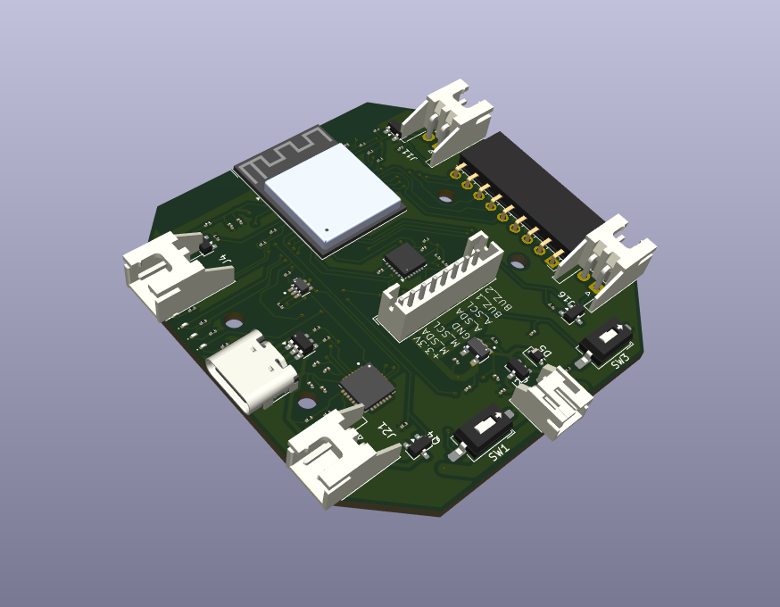
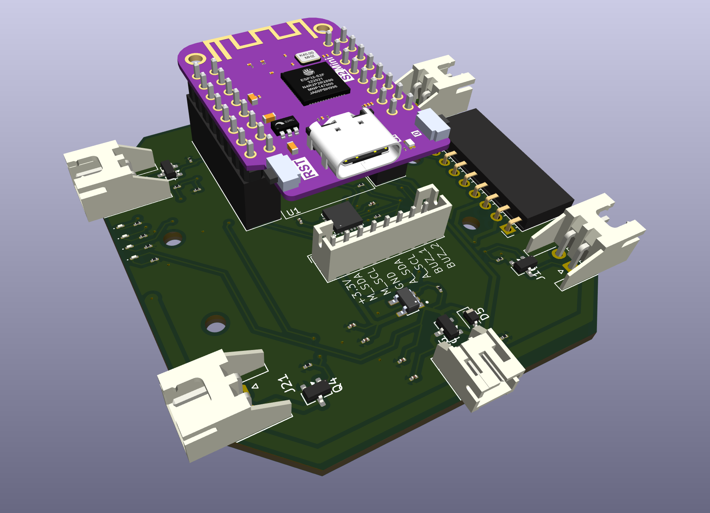

# PCB desings

Here you can find the desings of the two diferents PCB I made.

## [Plug PCB](https://github.com/ruibartsegura/ESP-Micro_drone/tree/main/PCB_design/ESP_plug_PCB/drone)

This PCB is designed to plug the ESP-32 s2 mini board.

## [SMT PCB](https://github.com/ruibartsegura/ESP-Micro_drone/tree/main/PCB_design/ESP_smt_PCB/drone)

This PCB is designed with the ESP-32 s2 mini as smt component.

  <table>
    <td align="center">
       
      SMT PCB
    </td>
    <td align="center" style="padding-right: 20px;">
       
      PLUG PCB
    </td>
  </table>

