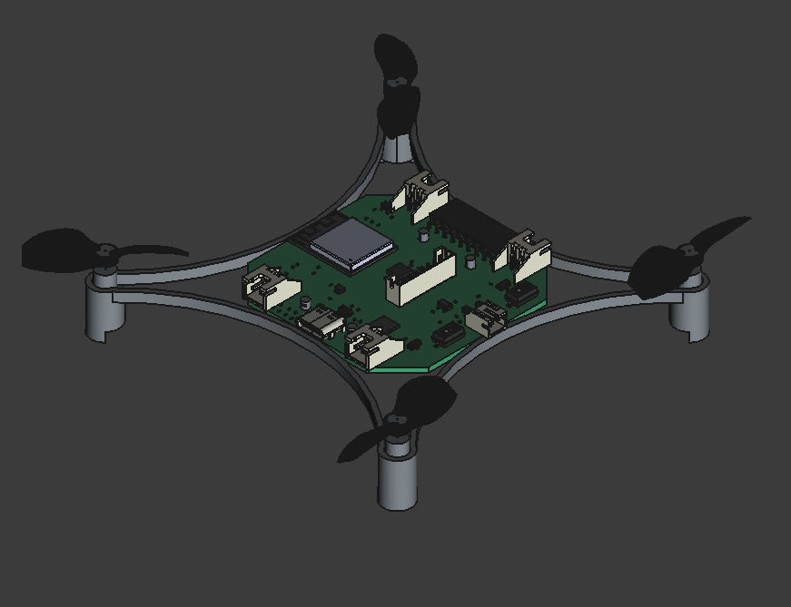
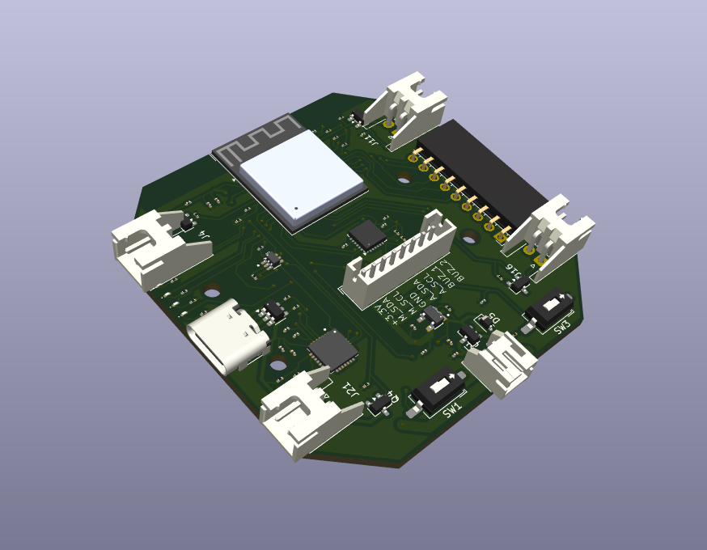
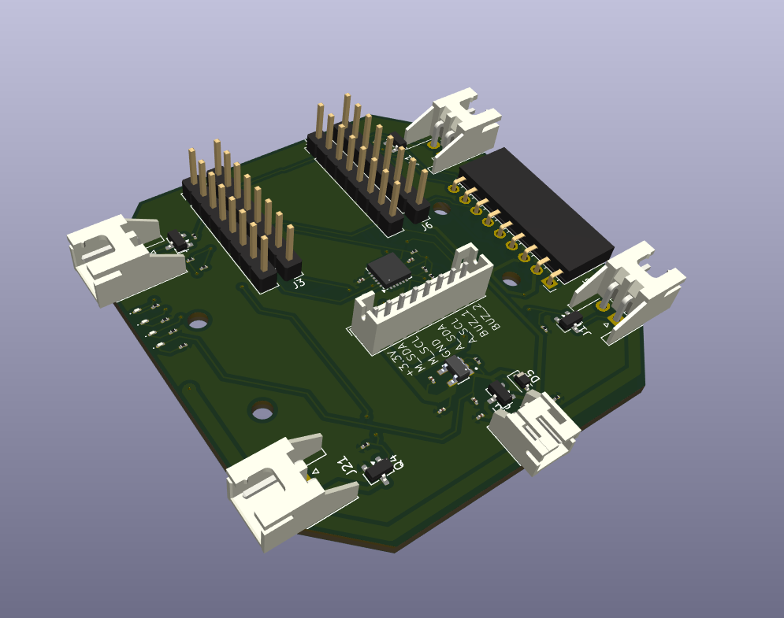

# ESP Micro Drone
## Intro
Development of a micro drone based on an ESP platform, adapted and extended through the integration of ROS. Using a ESP-32 s2 mini.  

  

 
 
## PCB Design
I made two diferents PCB, one if you want to put the ESP-32 s2 mini as smt and the other to plug it directly.

  <table>
    <td align="center">
       
      SMT PCB
    </td>
    <td align="center" style="padding-right: 20px;">
       
      PLUG PCB
    </td>
  </table>

